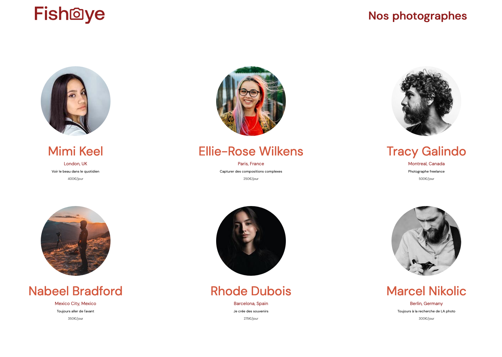
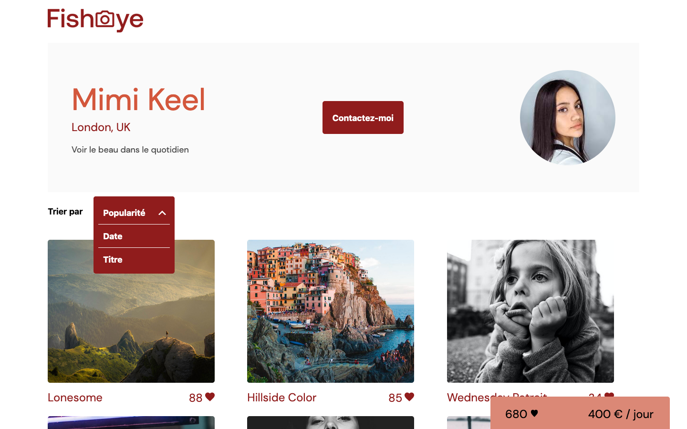
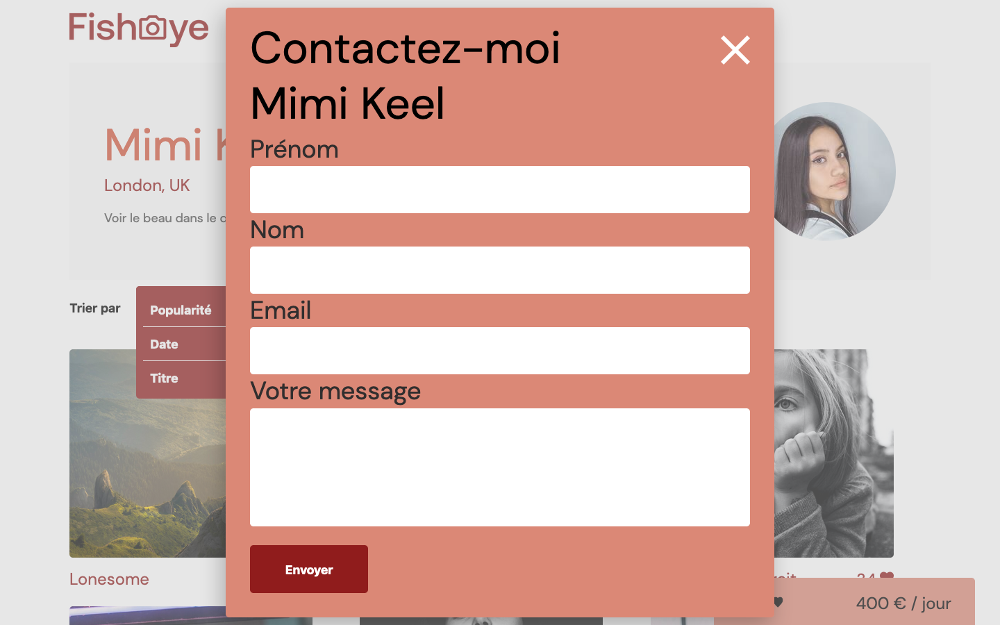
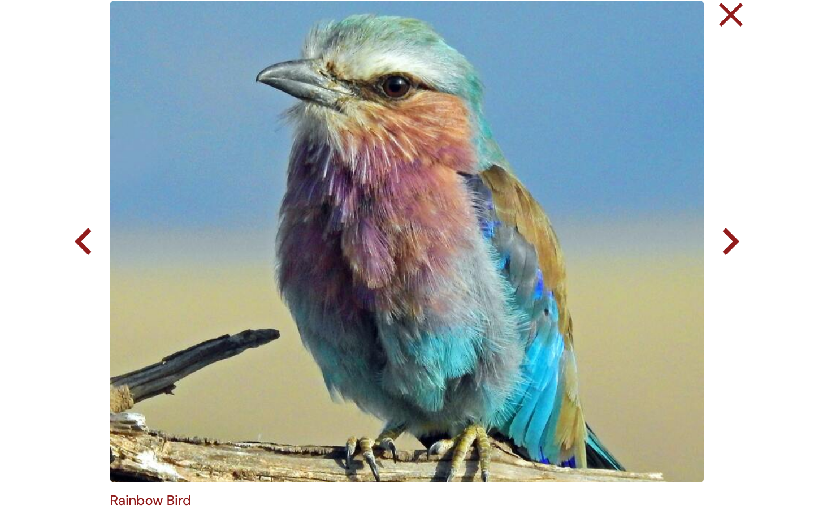

# FishEye

Projet n°6 du [parcours Développeur d'Application - JavaScript React](https://openclassrooms.com/fr/paths/516-developpeur-dapplication-javascript-react) d'OpenClassrooms : _Créez un site accessible pour une plateforme de photographes_.

> À partir des maquettes fournies, on nous demande de coder un site de photographes. La page d'accueil affiche la liste des photographes et le clic sur l'une des fiches amène vers la page dédiée à chaque photographe. Sur cette dernière, on retrouve les informations du photographe, une modale de contact ainsi que certains de ses travaux. Pour chaque media, un compteur de like est implémenté. Le clic sur un média ouvre une lightbox qui permet de l'afficher en grand format. L'ensemble du site doit être navigable au clavier.

## 📚 Technologie utilisées

- HTML
- CSS
- JavaScript

## 📎 Rendu visuel

## 💻 Démo du site

[FishEye](https://clementstorne.github.io/FishEye/)
